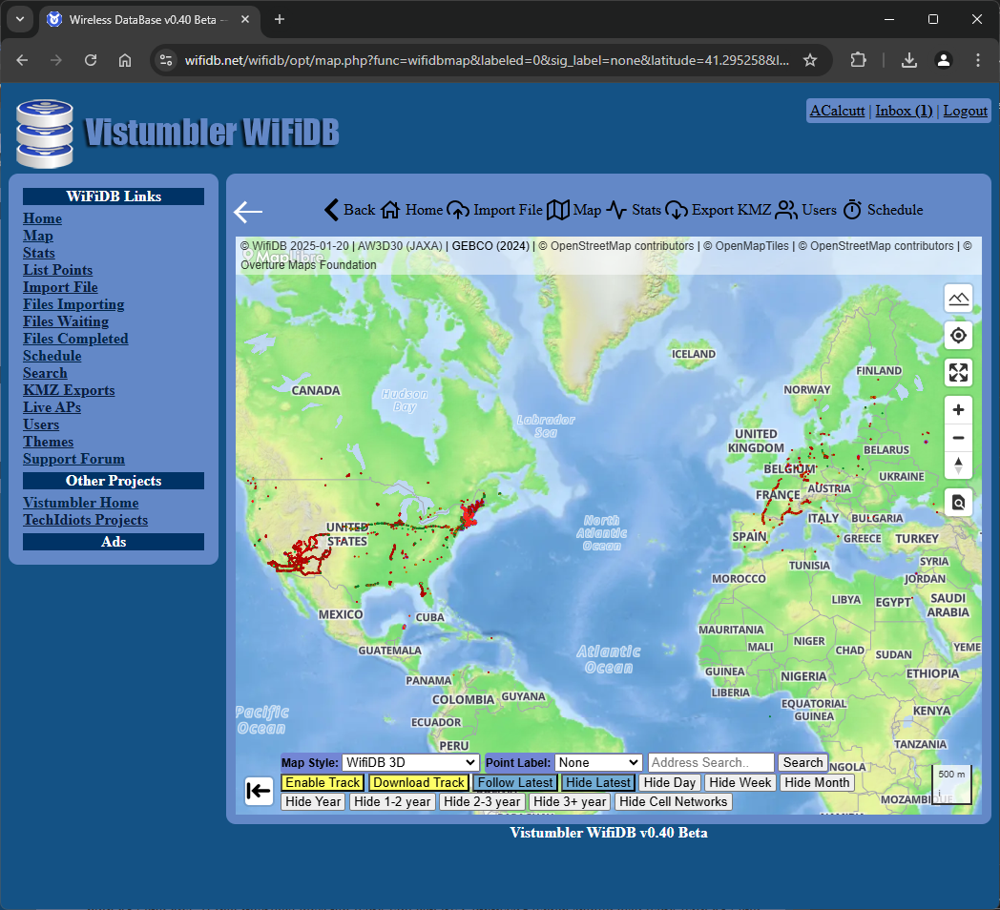

Vistumbler WifiDB is a project to collect wireless accesss points gathered by Vistumbler or other wireless network scanners. It generates statistics and maps from user uploaded wireless scans. It allows users to keep track of their uploads.

**Site Link**: [https://wifidb.net/](https://wifidb.net/)

	
Advertisement

	

        [adsense id="unique-id"][/adsense]
    

'