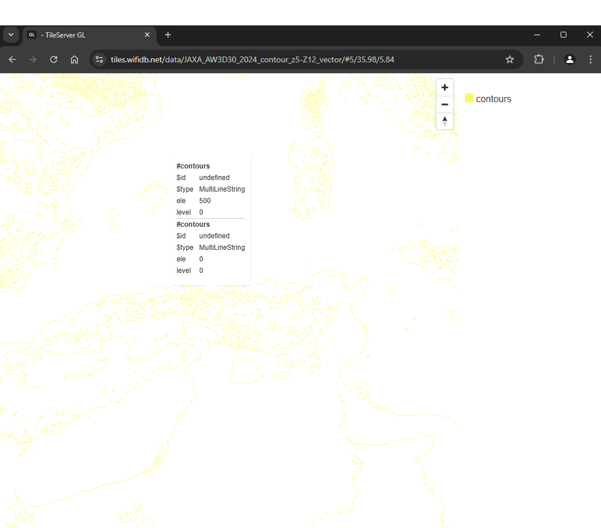

Contour Generator is a tool that helps you create contour line vector tiles from terrrain raster-dem using [maplibre-contour](https://github.com/onthegomap/maplibre-contour/). It allows maplibre-contour to use a local pmtiles or http pmtiles raster-dem source. The resulting vector tiles can be converted to mbtiles using [mbutil](https://github.com/mapbox/mbutil)

**Project Link**: [https://github.com/acalcutt/contour-generator](https://github.com/acalcutt/contour-generator)

	
Advertisement

	

        [adsense id="unique-id"][/adsense]
    

'