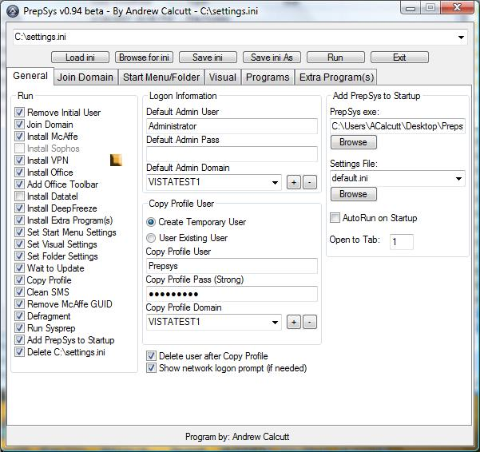

- Download: [PrepSys_v0.97.zip](PrepSys_v0.97.zip)
- Forum: [PrepSys Forum](http://forum.techidiots.net/forum/viewforum.php?f=19)
- Prepsys on the AutoIt website: [http://www.autoitscript.com/forum/index.php?showtopic=19771&amp;hl=Prepsys](http://www.autoitscript.com/forum/index.php?showtopic=19771&hl=Prepsys)
 
### Features

- Join Domain
- Install unattended applications using switches/autoinstalls
- Set windows settings
- Copy Working Profile to Default Profile
- Set Background
- Defragment
- Copys sysprep to c:\\sysprep and launches
- Save and Load all settings based on INI file
- Set PrepSys to AutoLaunch/AutoRun on next boot (I use this for the computers first boot after being deployed, to run a join domain ini)
- Open Source (AutoIt Scripting Language - [http://www.autoitscript.com](http://www.autoitscript.com/))
 

PrepSys v0.97 - 11/7/2007
-------------------------

- Download: [PrepSys_v0.97.zip](PrepSys_v0.97.zip)
 
### Changes

- Added option to turn off automatic updates
- Added option to delete IconCache.db
- Added bug fixes from the unrelease v0.96 (that I forget what are)
 
PrepSys v0.955 06-17-07
-----------------------

- Download:[PrepSys_v0.955.zip](PrepSys_v0.955.zip)
 
### Changes

- fixed problem where network credentials weren’t saved, so after a reboot programs wouldn't load (cause they could not authenticate)
- added windows installer into run menu
- started using "HKEY CURRENT USER" instead of searching for the registry location "HKEY\_USERS\\S-1-5-21......" ... it’s the same thing so there’s no need to search for it
- modified change computer name script so the NetBIOS name is limited to 15 characters (if it’s more than 25 it causes windows to not boot)
- various bug fixes
 
PrepSys v0.95 06-15-07
----------------------

- Download: [PrepSys_v0.95.zip](PrepSys_v0.95.zip)
 
PrepSys v0.945 03-01-07
-----------------------

- Download: [Prepsys_0.945.zip](Prepsys_0.945.zip)
 
PrepSys v0.935 07-16-06
-----------------------

- Download: [PrepSys_Final_v0.935.zip](PrepSys_Final_v0.935.zip)
 
### Changes

- Added Add Prepsys to startup section
- interface changes
- bug fixes
 
PrepSys v0.925 07-09-06
-----------------------

- Download: [PrepSys_Final_v0.925.zip](PrepSys_Final_v0.925.zip)
 
### Changes

- Bug fixes
 
PrepSys v0.92 07-07-06
----------------------

- Download: [PrepSys_Final_v0.92.zip](PrepSys_Final_v0.92.zip)
 
### Changes

- Added Join Domain Section \*note\* changing the machine name in the join domain tab changes the computers name
- Fix restart bug that would launch the system32 directory instead of Prepsys
 
PrepSys v0.91 07-04-06
----------------------

- Download: [PrepSys_Final_v0.91.zip](PrepSys_Final_v0.91.zip)
 
### Changes

- updated GUI
- Updated Copy Profile Script
- Removed Office Serial section
- Updated Desktop Image Script
- Added Support for Domain Users from Default Admin and Copy Profile Users
 
PrepSys v0.9 06-24-06
---------------------

- Download: [PrepSys_Final.zip](PrepSys_Final.zip)
 
### Changes

- Added support for switches
- Added Support for multiple configurations
- Added Extra Programs Install section
- Added deepfreeze install option
- Updated and simplified various parts of code
 
PrepSys v0.8 03-08-06
---------------------

- Download: [PrepSys_Final_Beta0.8.zip](PrepSys_Final_Beta0.8.zip)
 
PrepSys v0.6 02-04-06
---------------------

- Download:[prepsys_v0.6.zip](prepsys_v0.6.zip)
 
PrepSys v0.5 01-11-06
---------------------

- Download: [prepsysv_v0.5.zip](prepsysv_v0.5.zip)

	
Advertisement

	

        [adsense id="unique-id"][/adsense]
    

