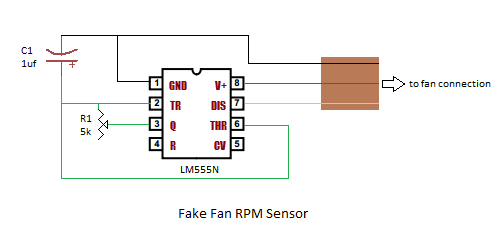
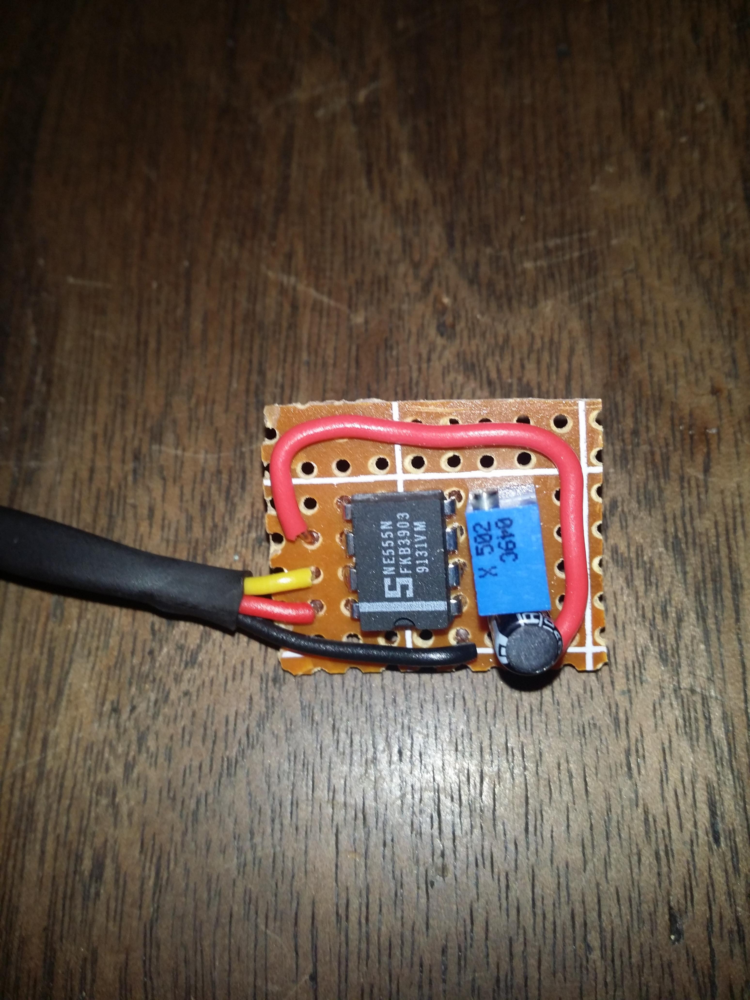
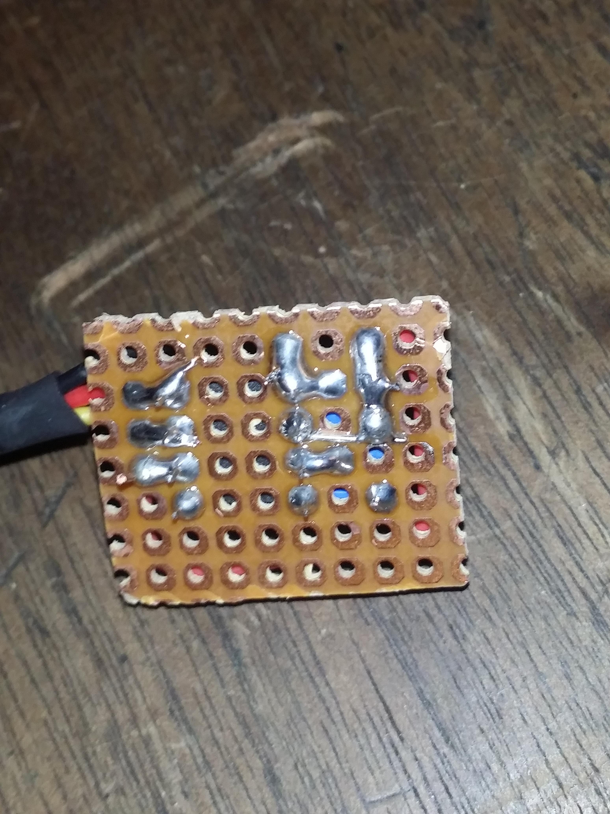
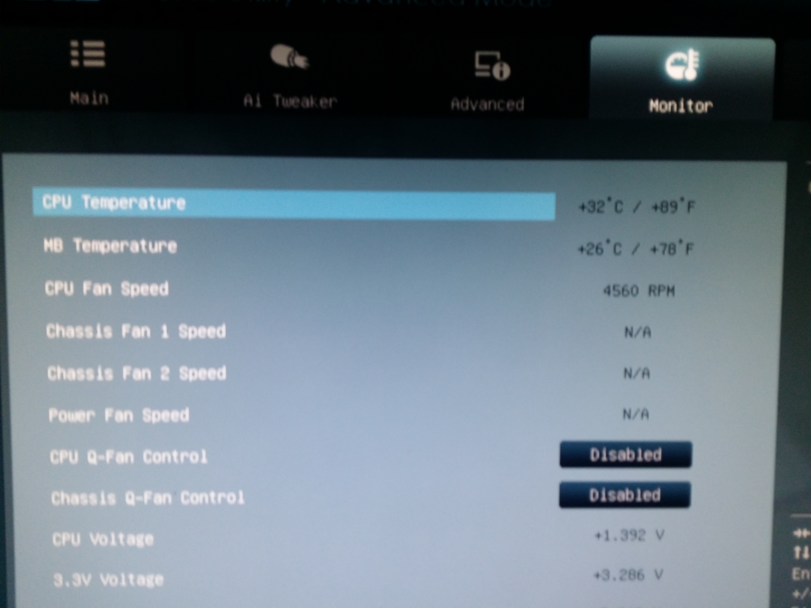
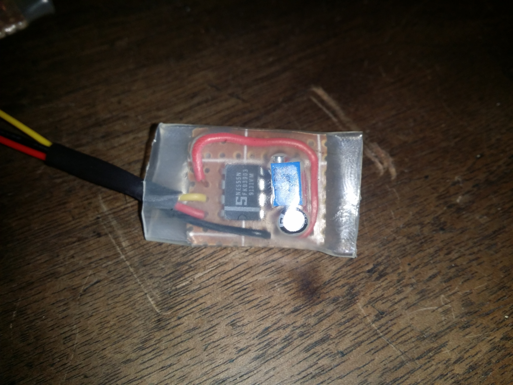

## Fake Fan RPM Sensor using an LM555N Timer

This article details the construction of circuit that emulates a fan's RPM signal. This emulator allows you to bypass CPU fan errors in situations where a traditional fan is not present, such as custom water cooling setups or when using fanless cooling. This can be particularly useful for preventing BIOS or virtualization software (like VMware ESXi) from generating unnecessary warnings.

### Background and Inspiration

The design presented here is a modification of a circuit originally described by "Mohonri" on the \[H]ard|Forum ([link to forum thread](http://hardforum.com/showthread.php?t=1606397)).  I have corrected a minor pinout error in the original schematic and used that to produce the two finished circuits in the below images.

### How it Works

The circuit utilizes an LM555N timer IC configured in astable mode. This configuration allows the 555 to output a square wave with an adjustable frequency, simulating the pulses generated by a fan's RPM sensor. 

Mohonri's explanation of the timing circuit is as follows:

> "Tie the Threshold and Trigger pins together. Place a capacitor between these two pins and ground. Connect a resistor between the Output and these two pins.
>
> Fans typically pull the RPM line low twice per revolution, for a quarter-revolution each time. For example, an 8000 RPM fan will pull the line low 16,000 times per minute, or about 267 times per second (approximately every 3.75 ms). The line needs to be pulled low for half the time and left floating for the other half. This gives a time constant of approximately 1.875 ms. The time constant roughly equals R * C (the resistor and capacitor's values multiplied).
>
> Using a 1uF capacitor, a resistor of approximately 1.875 kOhm would be needed to achieve the target frequency. However, using a 5k potentiometer (variable resistor) between the output and threshold/trigger pins, this frequency can be adjusted as needed. Finally, tie the Discharge pin to the RPM signal."

### Circuit Diagram

### Completed Circuit Images

[gallery]

[/gallery]

	
Advertisement

	

    [adsense id="unique-id"][/adsense]
  

