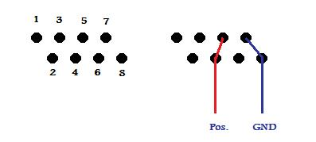
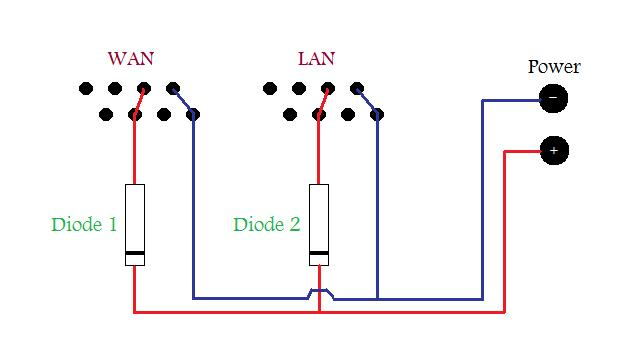
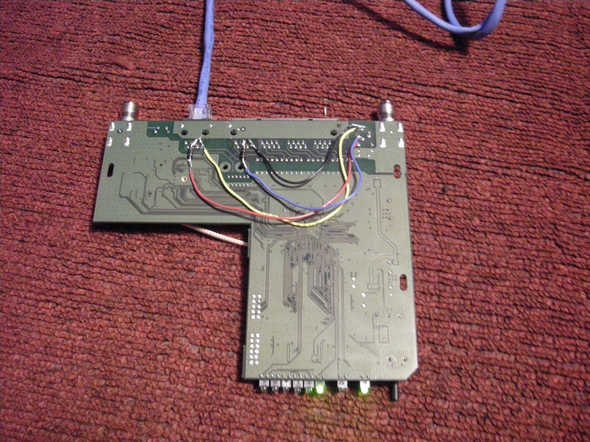
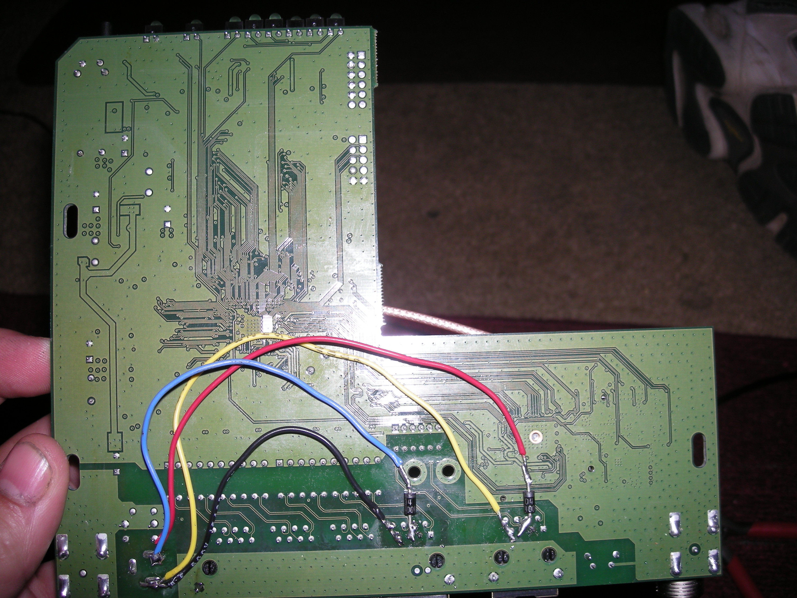
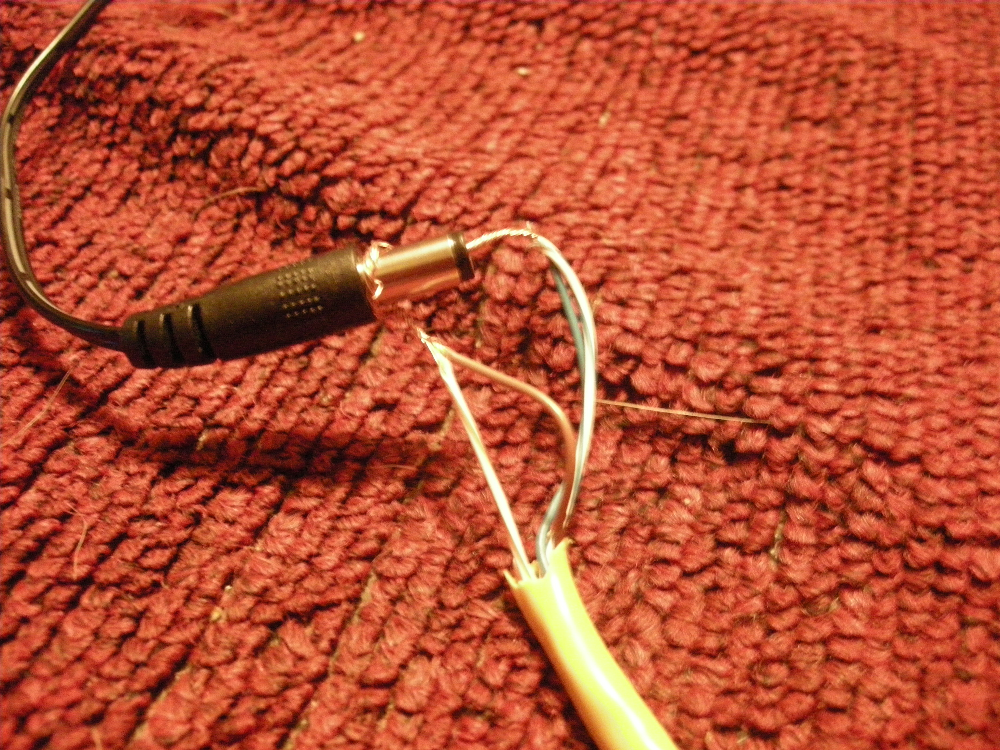
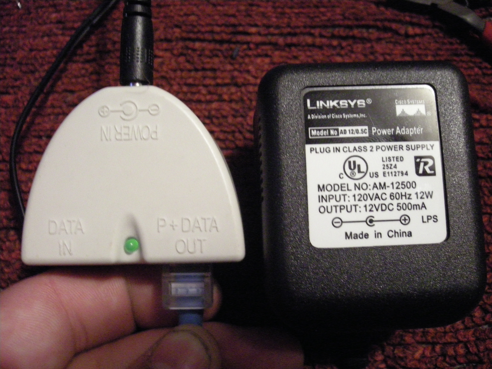
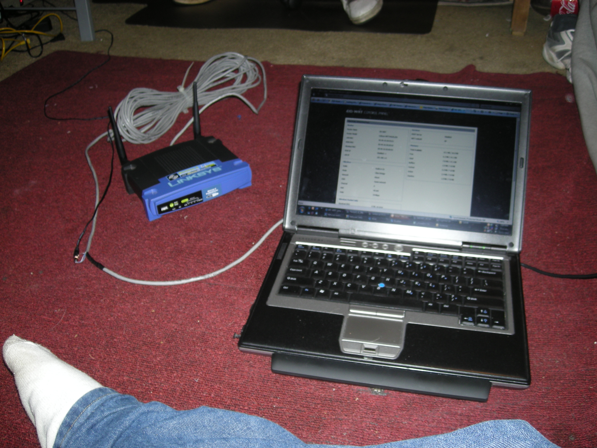

A few weeks ago a friend of mine was trying to get internet access at his job. Outside his building was free wireless internet provided by the city of Worcester (after a free registration). Unfortunately for him, the signal could not get through the brick building.

A few month before I had seen an article on making a WRT54G into a POE device, so we decided to try it. In combination with DD-WRT firmware we set it up as a POE wireless bridge. The article I had read had been removed from the Linksys forum, so I only had a few horrible pictures to go by.

The idea behind POE is you use the 4 unused wires in a network cable to transmit DC power. Positive is connected to pins 4 and 5, and Ground is connected to pins 7 and 8. True POE is 48v. Our POE is only 12v, so do not use a true 48v power injector or you **WILL** blow up your router.

In our router, we wanted to make it so we could power it with a WAN port, a LAN port, or the actual power connector. I also added two diodes in so that when the device was powered it would not be feeding 12v up other lines connected and into another device. These diodes were just pulled out of some dell speakers (if I remember right they can handle up to 24v according to their specs). Any Diode that can handle 12v should do. The wiring goes like this.

So, what I am doing is making my own connection from the Ethernet ports and connecting to the actual power connection, which turns out like this.

[gallery]

[/gallery]

Now to power the device you need to send 12v over the Ethernet cable over the lines that connect to pins 4+5 (blue wires) and 7+8 (brown wires). In my original test I just cut the cable, but to use this for data, you would need to keep all other color wires uncut like the second picture.

[gallery]

[/gallery]

Eventually we got a power injector that allowed us to plug in the Linksys adapter without having to cut any wires.

[gallery]

[/gallery]

The end result of this is a router that can function a good distance away from any plug. The max Ethernet cable length is 328ft at 100mb. I have read that the WRT54G will work down to 5.5v and that means that with voltage drop this router would still have enough power at around 500 feet of cable. (I read this someplace...at some point I will calculate the actual voltage drop and post it...unless some beats me to it). Don't forget that the diodes also drop the voltage .7 volts.

This is our first connection. We are on the routers internal web page (dd-wrt firmware). The only wire plugged into the router is a network cable. The other end of this cable is plugged into my laptop. From the outside it looks like a normal router.

[gallery]

[/gallery]

My friend was able to find a location that got wireless signal to the Worcester wireless. He set up the router as a wireless bridge and connected his laptop into the LAN port (also powering it over that port). This allowed him to connect to the wireless over the LAN wire. This would have been impossible without POE since there was no power available in this location.

Eventually I would like to attempt to make this a true POE router by use of a rectifier. The closest rectifier I found was 45v --&gt; 12v, but with voltage drop that may be enough...I will see

More/bigger pictures can be found here --&gt; [wrt54gs-poe-12v-mod](../../media/pictures/projects/wrt54gs-poe-12v-mod)

	
Advertisement

	

        [adsense id="unique-id"][/adsense]
    

'