**Using A PC Power Supply To Power A Car Amp And A 15in Sub**

Recently a friend of mine wanted to use some car components in his home stereo. The Idea was to go from his home stereo subwoofer pre-amp out into the car amp, then to the 15 in sub. The problem was getting a power supply that could supply the power necessary for the amp (even when the amp was putting out a good amount of bass). After some researching I decided that the easiest option would be a computer power supply.

We had an extra 500w power supply laying around. This power supply is capable 25A on its +15v line. The power supply is a little on the low end side to power a car amp. In the car the amp would get ~14v and towards ~50A or more can be provided by the alternator. Because of this we decided we would at least need to get a capacitor to smooth out the voltage a little and help protect the power supply.

[gallery]
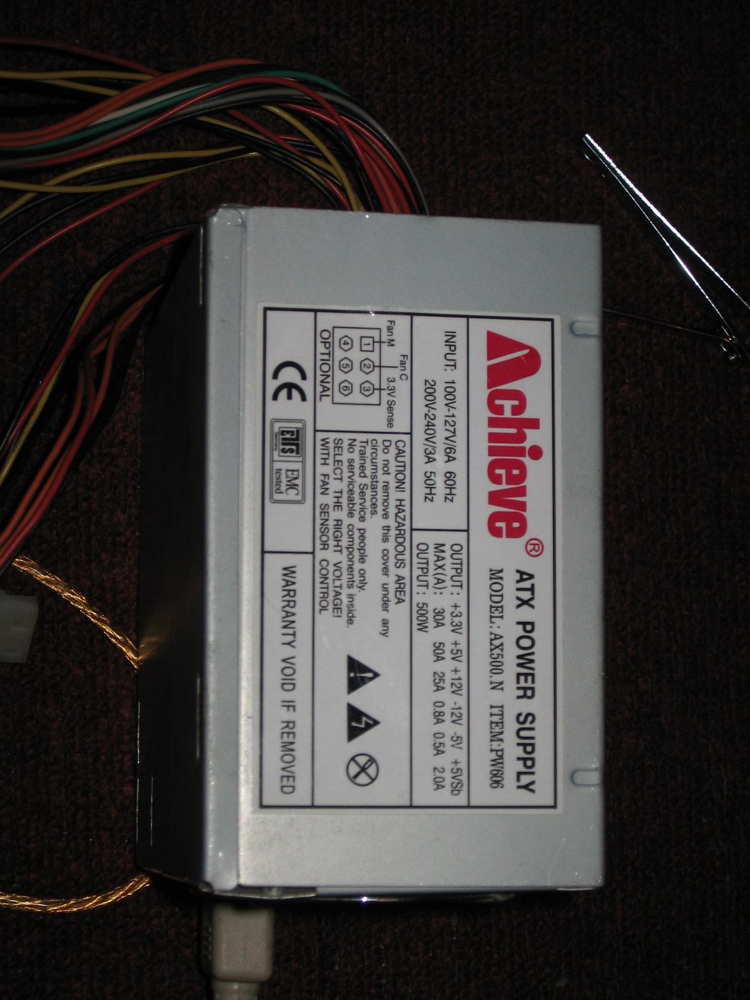
[/gallery]

We started testing without the capacitor. To turn on the supply we connected pin 14(green) and 15(black) on the ATX connector

[gallery]
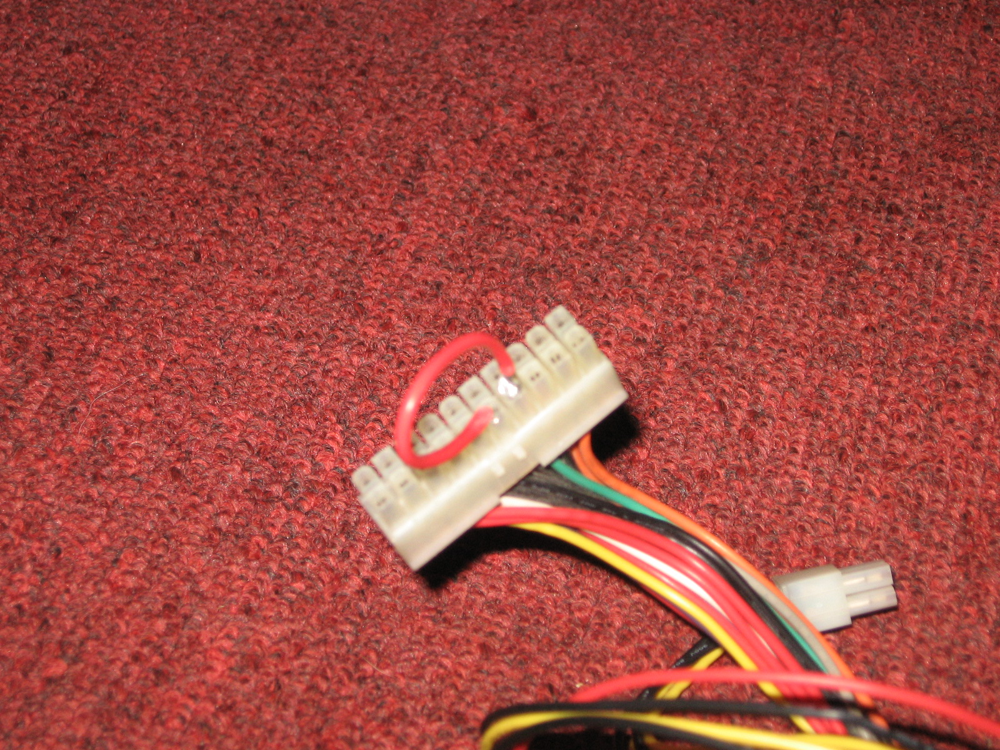
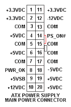
[/gallery]

On our first test we just used in extra female Molex connector to connect the amp to the computer power supply. This Was proof of concept. The Amp was working and it actually sounded good, but we didn't want to put too much of a load on the power supply. For the amp to turn on it needs a + voltage to the Remote line. We connected the remote line to +12v.

[gallery]
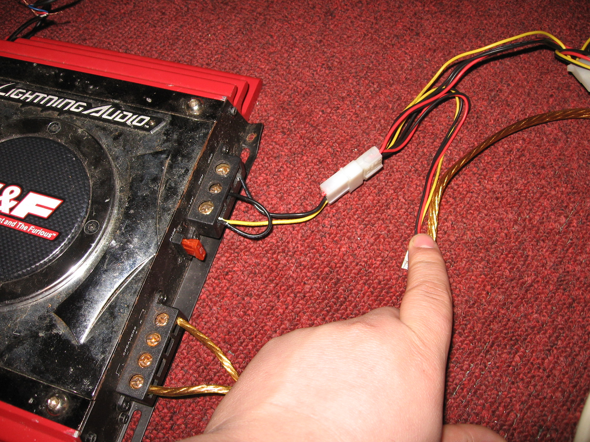
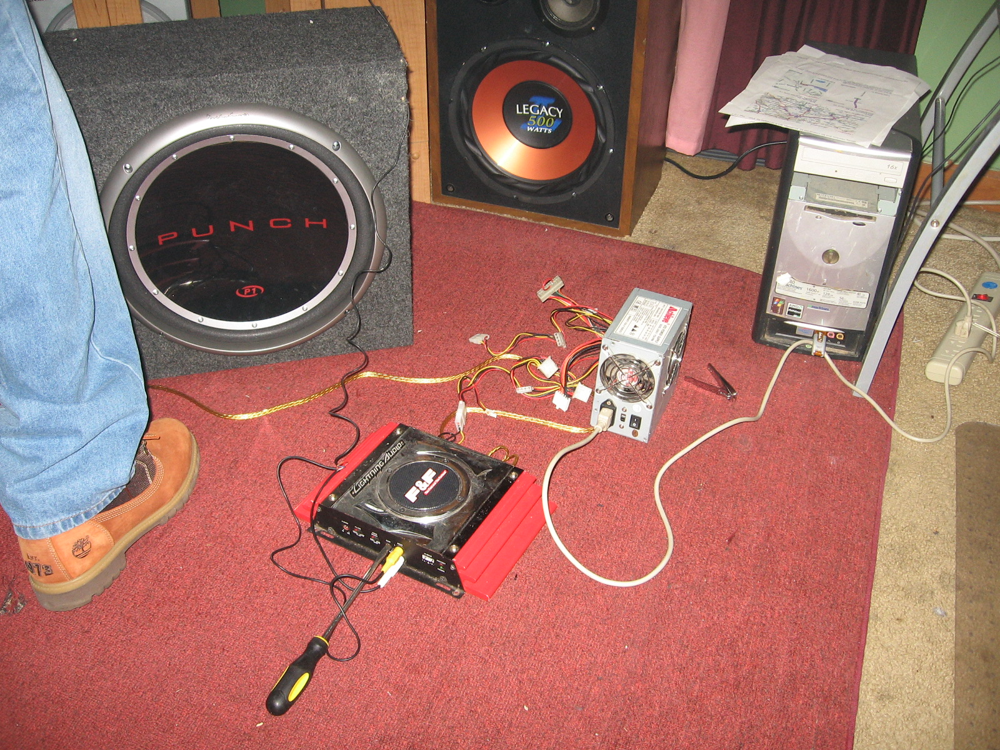
[/gallery]

After our initial test we got rid of the unnecessary wires on the power supply. We need to keep the green wire (PS\_ON), a yellow wire (+12), and a black wire (GND).

For the power supply to turn on the green and the black wire have to be connected. For now they are just manually connected. we will change this when we get the rest of our parts

[gallery]
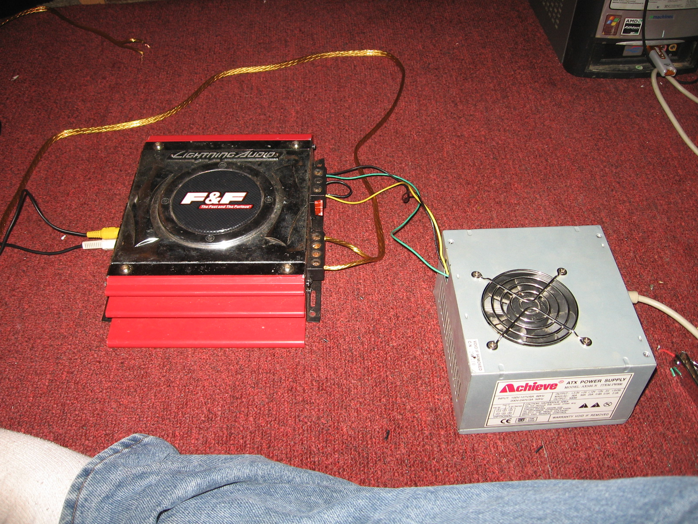
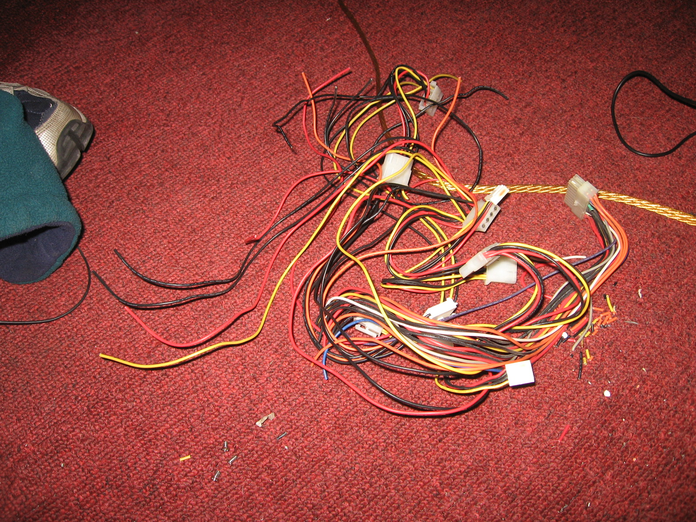
[/gallery]

A few days later we got our capacitor. It is a 3.0F capacitor. We soon found out that until the capacitor is charged, it acts like a short. We had to get a resistor so that the power supply wouldn't shut off when hooked to the capacitor. RadioShack only had 100ohm 10w power resistors. We hooked 8 of them in parallel (to give us 12.5ohms). This allows the capacitor to charge without shutting off the power supply. It is still a little slow charging. I believe that is because when the capacitor is at a short, a 12.5ohm resistor only creates 0.96Amps. We ordered 3 1.5ohm 100W resistors for 0.5ohm in parallel, creating 24A , unfortunately the vendor could only supply one of them, meaning we will only have a current of 8A

[gallery]
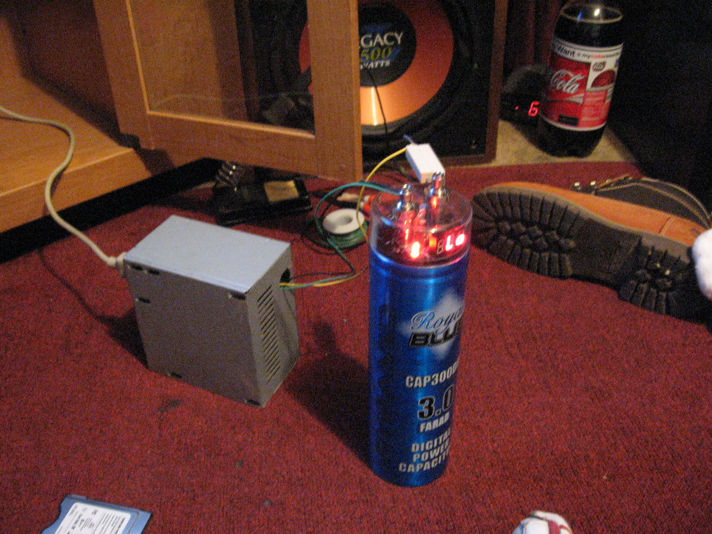
[/gallery]

Because the resitor is dropping power, it was not a high enough voltage for the capacitor. the capacitor would start alarming under 10v. Ifound that if we took of the load(thye amp) and let the capacitor charge to 10v volts, we could bypass the resistor(notice the red wire in the pic below) and the power supply wouldn't turn off. this allows us the maximum that the power supply can put out without having the voltage drop from the resitor.

[gallery]
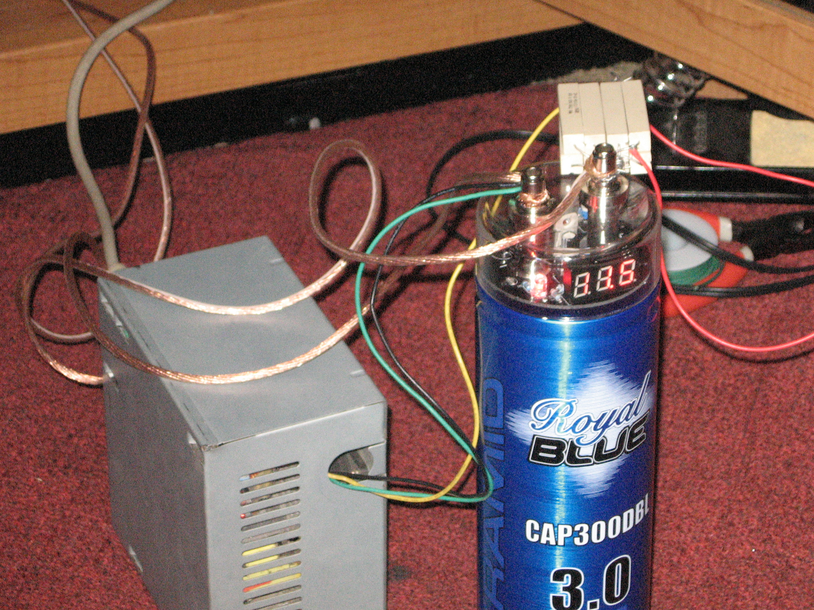
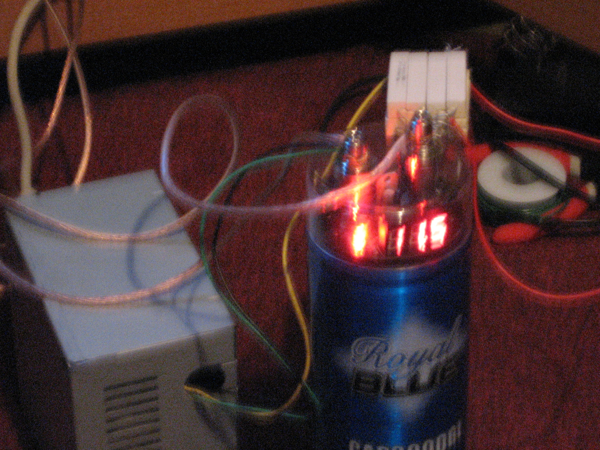
[/gallery]

Once the capacitor was charged we can turn the amp on. The sound was really good, and this was just our test Amp.

**View the test video here --&gt; [Test PC PSU Car Amp](../../media/videos/using-a-pc-psu-to-power-a-car-amp)**

**More Pictures --&gt; [Pictures](../../media/pictures/projects/car-amp-project)**

Currently this is set up with an audiobahn amp

[gallery]
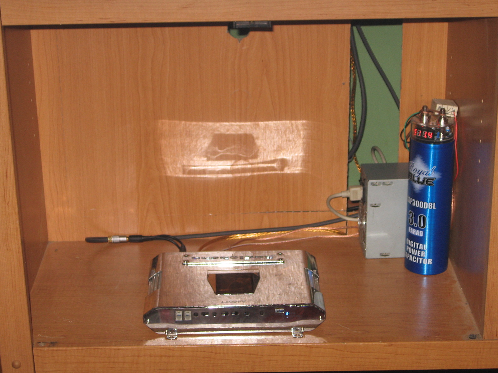
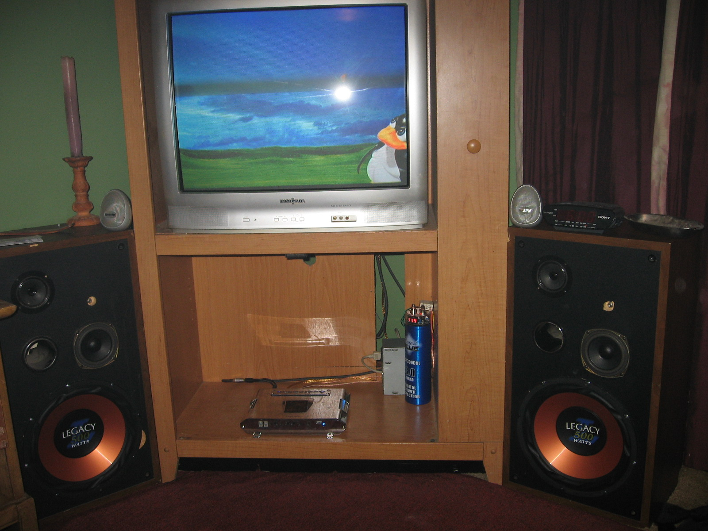
[/gallery]

	
Advertisement

	

        [adsense id="unique-id"][/adsense]
    

'