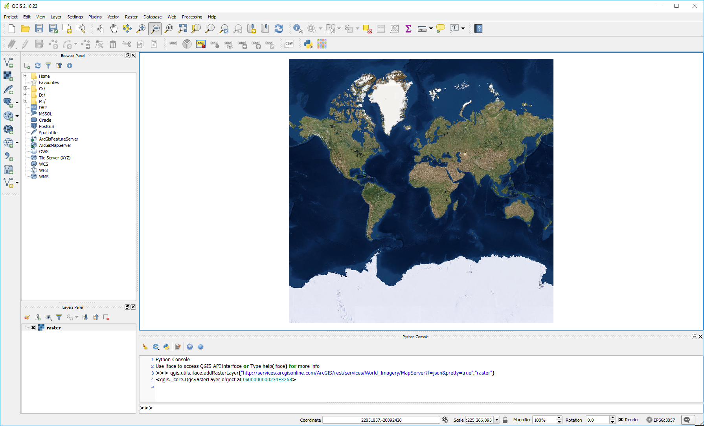
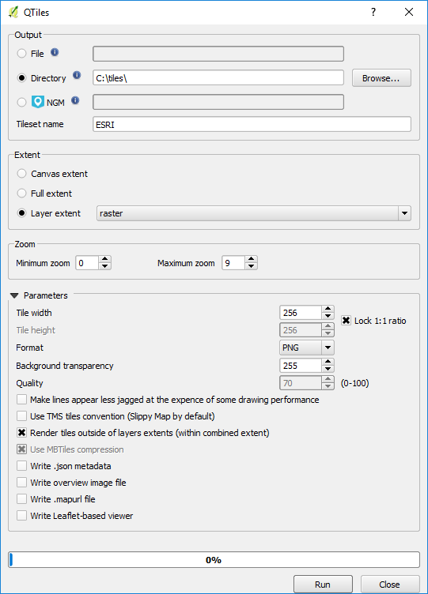

References
----------

[https://www.qgistutorials.com/en/docs/creating\_basemaps\_with\_qtiles.html  ](https://www.qgistutorials.com/en/docs/creating_basemaps_with_qtiles.html)[https://ieqgis.wordpress.com/2014/08/09/adding-esris-online-world-imagery-dataset-to-qgis/  ](https://ieqgis.wordpress.com/2014/08/09/adding-esris-online-world-imagery-dataset-to-qgis/)<https://gis.stackexchange.com/questions/50646/is-there-any-way-to-use-mbutil-on-windows>

Instructions
------------

1.) Install [QGIS 2.18.22](https://qgis.org/downloads/) (newer versions do not support the qtiles plugin)

2.) In QGIS Desktop, add the Qtiles plugin (Plugins --&gt; Manage and install plugins)

3.) In QGIS, open the python console (Plugins --&gt; python console)

4.) In the python console, load the World\_Imagery raster map with "qgis.utils.iface.addRasterLayer("http://services.arcgisonline.com/ArcGIS/rest/services/World\_Imagery/MapServer?f=json&amp;pretty=true","raster")" or the ESRI\_Imagery\_World\_2D raster map with "qgis.utils.iface.addRasterLayer("http://server.arcgisonline.com/arcgis/rest/services/ESRI\_Imagery\_World\_2D/MapServer?f=json&amp;pretty=true","raster")"

[gallery]

[/gallery]

5.) Open QTiles (Plugins --&gt;  QTiles --&gt;  QTiles ), set destination folder, set extent to the map raster layer, and set the zoom levels you would like to map (note that the higher zoom levels use more disk space. layer 0-9 used 17GB of disk space, and each additional zoom level uses about 4 times more space.) (note you can export directly to mbtiles, but I am downloading to folder so i can download in batches and merge them later)

[gallery]

[/gallery]

6.) Use mbutil to create a mbtiles file from the qtiles output directory

\- Create a 'metadata.json' and add it to the image directory (ex C:\\tiles\\ESRI\\)

 {  
 "name": "ESRI\_0-9",  
 "description": "Created with QTiles and mbutil",  
 "format": "png",  
 "minZoom": "0",  
 "maxZoom": "9",  
 "type": "baselayer",  
 "version": "1.1",  
 "bounds": "-180.0,-85.0511287798,180.0,85.0511287798",  
 "attribution": "&lt;a href=\\"http://www.arcgis.com/home/item.html?id=10df2279f9684e4a9f6a7f08febac2a9\\" target=\\"\_blank\\"&gt;&amp;copy; ERSI&lt;/a&gt;"  
 }

 - Run mb-util import

 mb-util.py --do\_compression C:\\tiles\\ESRI C:\\ESRI\_0-9.mbtiles

	
Advertisement

	

        [adsense id="unique-id"][/adsense]
    

'