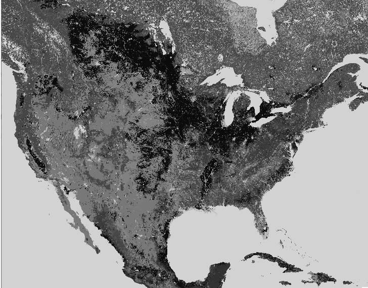

<https://www.esa-landcover-cci.org/?q=node/164>

For this I had to rebuild my gdal with NETCDF support by installing libnetcdf-dev before compiling gdal, then i ran these commands.  
  
  ```
gdalwarp -of Gtiff -co COMPRESS=LZW -co TILED=YES -ot Byte -te -180.0000000 -90.0000000 180.0000000 90.0000000 -tr 0.002777777777778 0.002777777777778 -t\_srs EPSG:4326 NETCDF:C3S-LC-L4-LCCS-Map-300m-P1Y-2020-v2.1.1.nc:lccs\_class C3S-LC-L4-LCCS-Map-300m-P1Y-2020-v2.1.1.tif

gdalwarp -co COMPRESS=LZW -ot Byte -t\_srs EPSG:3857 C3S-LC-L4-LCCS-Map-300m-P1Y-2020-v2.1.1.tif warp.vrt

gdal\_translate warp.vrt landcover.mbtiles

gdaladdo landcover.mbtiles  
```


<div style="border: 1px solid #ddd; margin-bottom: 20px; padding: 10px; background-color: #f9f9f9;">
	<div style="font-weight: bold; text-align: center;">Advertisement</div>
	<div class="adsense-content" style="margin-top: 5px; text-align: center;">
        [adsense id="unique-id"][/adsense]
    </div>
</div>'