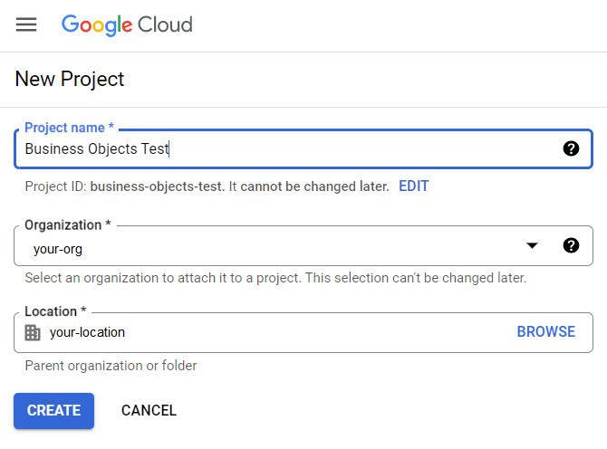
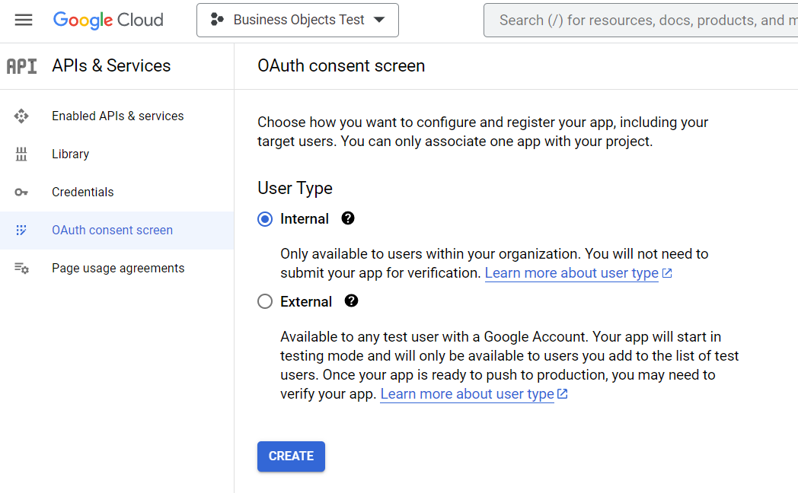
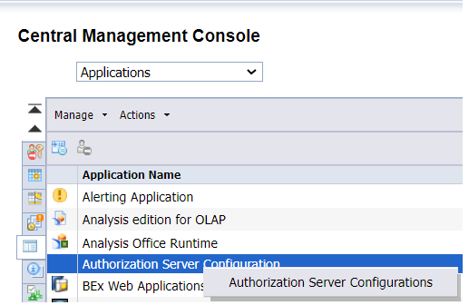
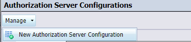
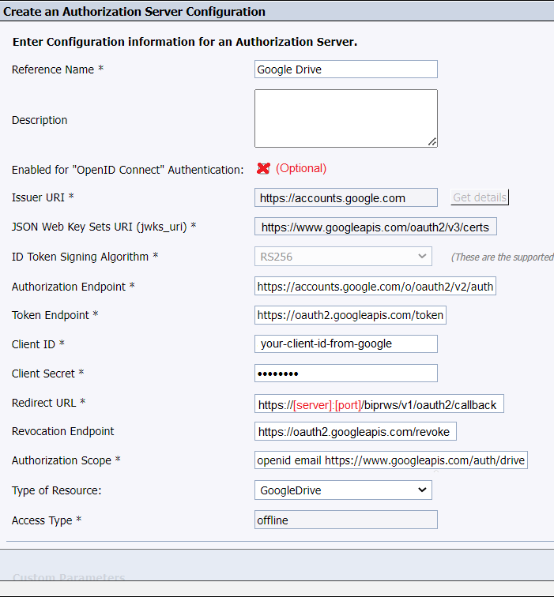
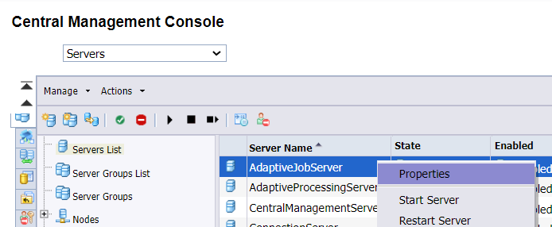
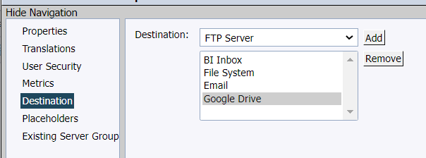

### References

- <https://blogs.sap.com/2021/12/08/sap-bi-4.3-sp2-whats-new-in-web-intelligence-and-semantic-layer/#GOOG>
- <https://blogs.sap.com/2022/12/08/microsoft-drive-support-in-sap-businessobjects-4.3-sp03-release/>
- <https://developers.google.com/identity/openid-connect/openid-connect#appsetup>
 
### Google Steps

1. Go to the<span> </span>[Credentials page ](https://console.developers.google.com/apis/credentials)and log in with your google admin user.
2. Create a new project (or edit an existing one)  

3. In your new project, go to the "OAuth consent screen". Choose type of authentication and click create.  

4. Enter "App information", "App domain", "authorized domains", and "Developer contact information" info
5. Add Scopes  
    
    1. I checked 
        - <span>openid</span>
        - <span>.../auth/userinfo.email</span><span>  
              
            </span>
    2. <span>I manually added</span>
        - <span>https://www.googleapis.com/auth/drive  
              
            </span>
6. Click "Save and Continue" to save the OAuth consent screen settings
7. Click "Credentials" in the side menu
8. "Click "Create Credentials" and select "Oauth client ID"
9. Select "Web Application" and fill out the "Authorized redirect URIs" and click "Create"  
      
     ```
    https://[server]:[port]/biprws/v1/oauth2/callback
    ```
10. Copy down the client id and client secret. Download the json file. The json file also has the client id and client secret, plus other information needed below.
11. Click OK
12. Click "Enable APIs &amp; Services" in the side menu
13. Click the "+Enable APIs &amp; Service" button
14. Search for "Google Drive API" and enable it
 
### Business Objects Steps

1. In the CMC, go to the "Applications" section
2. Right click "Authorization Server Configurations" and choose "Authorization Server Configurations"  
      

3. Click "Manage -&gt; New Authorization Server"  

4. Enter the items listed below. Most of these values come from you Google API creditials JSON file  

    
    1. Reference Name**<span> </span>– Choose a unique random string and enter the same to identify the configuration, to recognize and choose the configuration in different workflows for achieving Authorization-based SSO.  
          
         ```
        Google Drive
        ```
    2. **Description (**<u>Optional</u>**)**<span> </span>– Enter any statement and keywords to describe and quickly identify the configuration out of the list of available configurations.  
          
        ("Blank" in example)
    3. By default, Google OAuth 2.0 can be used both for authentications and authorization. If you want to configure the OpenID Connect for authentications, set the following settings  
          
        <span style="text-decoration: underline;"></span>
        1. **Enable** “OpenID Connect” Authentication
        2. **Issuer URI :** https://accounts.google.com
        3. **<span>JSON Web Key Sets URI (jwks\_uri) : </span>**https://www.googleapis.com/oauth2/v3/certs
        4. **<span>ID Token Signing Algorithm: </span>**RS256**<span>  
            </span>
    4. **Authorization Endpoint**<span> </span>– Enter the URL of the authorization server with which one can get the authorization grant  
          
         ```
        <strong>https://accounts.google.com/o/oauth2/v2/auth</strong>
        ```
        
           
        <span style="text-decoration: underline;"></span>
    5. **Token Endpoint**<span> </span>– Enter the URL of the authorization server, with which one can request an access token by exchanging the authorization code  
          
         ```
        <strong>https://oauth2.googleapis.com/token</strong>
        ```
    6. **Client ID**<span> </span>– Enter the name of the Application which is used to register BI Landscape with the Authorization Server  
          
        (This came from the google credential json file)
    7. **Client Secret**<span> </span>– Enter the specific secret code corresponding to the Application which is used in registering the BI Landscape with the Authorization Server  
          
        (This came from the google credential json file)
    8. **Redirect URL**<span> </span>– Enter the URL of the BI Landscape endpoint to which the authorization code has to be sent by the Authorization server after successfully validating the authorization. For this purpose, a<span> </span>**new endpoint** has been introduced in the **REST API**<span> </span>of the BI Platform, i.e.<span> </span>**/oauth2/callback**. Hence the URL should be as follows:<span> </span>**https://\[server\]:\[port\]&gt;/biprws/v1/oauth2/callback**. 
        - **Note:**
            - Here the **\[server\]**<span> </span>will be the system name hosting the BI landscape application server, where **RESTful web services application (biprws)**<span> </span>is deployed. And \[port\] will be the **SSL port**<span> </span>of the application server.
            - This same url is used for the ""Authorized redirect URIs" url in the Google Steps above.
    9. **Revocation Endpoint** **(**<u>Optional</u>**)**<span> </span>– Enter the URL of the authorization server, with which the application can request the revocation of all previously issued Access Tokens through a specific Refresh Token  
          
         ```
        <strong>https://oauth2.googleapis.com/revoke</strong>
        ```
    10. **Authorization Scope**<span>  
        </span>  
         ```
        <span><strong>openid email https://www.googleapis.com/auth/drive</strong></span>
        ```
        
         <span>  
        </span>
    11. **Type of Resource**<span> </span>– 
        - **Google Drive**
    12. **Custom Parameters (**Optional**)**<span> </span>– Enter any custom parameters required to send while requesting the authorization based on any custom requirements (if needed) of the Authorization Server being configured. 
        - **Note:**
            - The name of the custom parameter should be unique in the configuration
            - At maximum 5 custom parameters are allowed to be configured in any Authorization configuration
5. Enable Google Drive Destination in Job Server 
    1. In the CMC, go to the "Servers" section
    2. Find your "AdaptiveJobServer" server and go to properties.  
        
    3. Under "Destinations" add "Google Drive"  
       
       
<div style="border: 1px solid #ddd; margin-bottom: 20px; padding: 10px; background-color: #f9f9f9;">
	<div style="font-weight: bold; text-align: center;">Advertisement</div>
	<div class="adsense-content" style="margin-top: 5px; text-align: center;">
        [adsense id="unique-id"][/adsense]
    </div>
</div>'