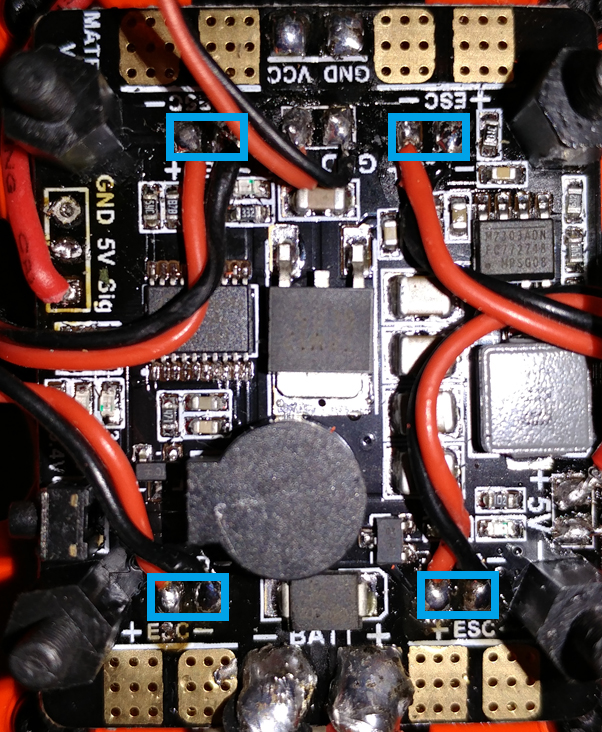
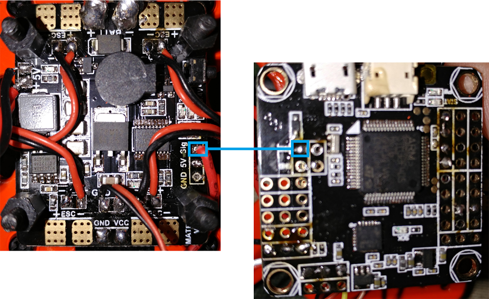
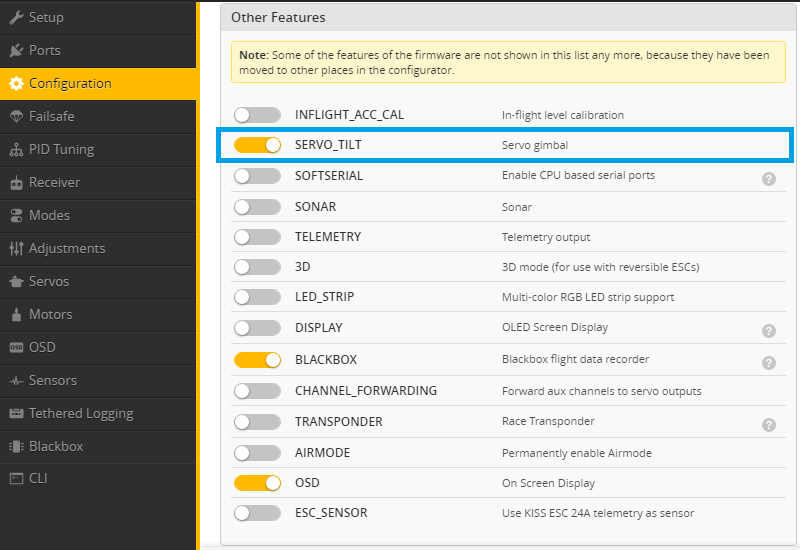
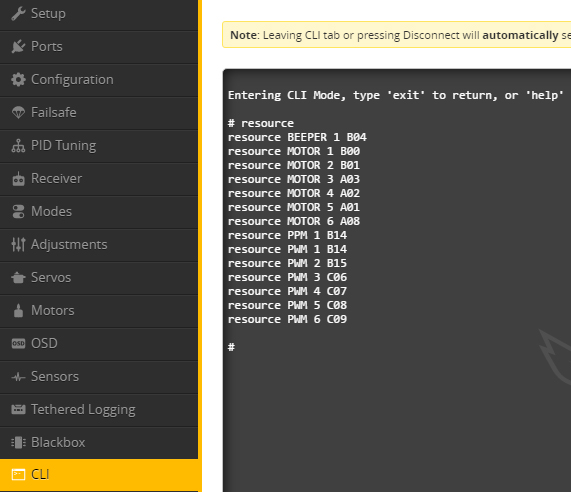
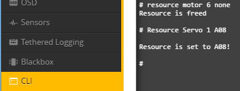
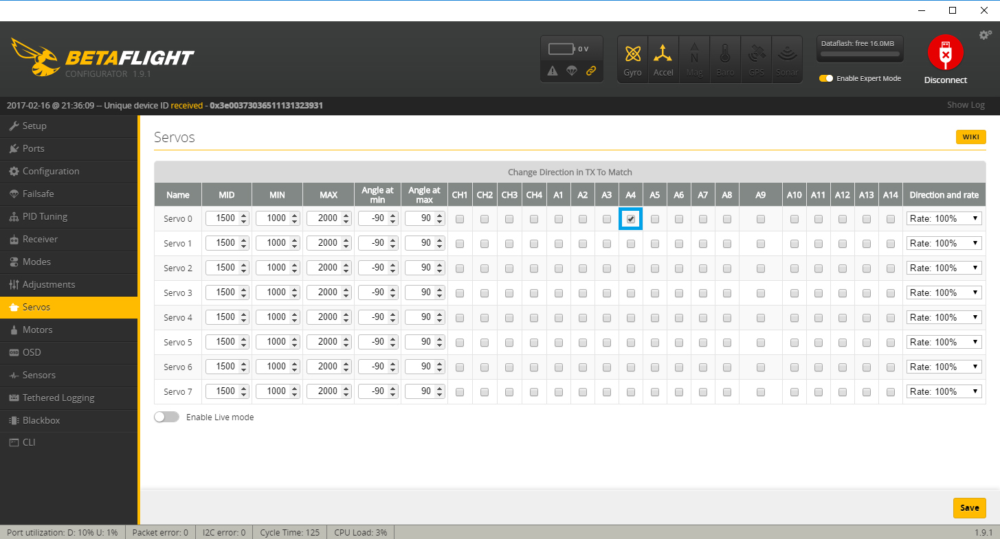

References
----------

[Naze32 aux channel pass through](https://www.youtube.com/watch?v=73DLKH_YXx0) (\*note\* in betaflight 3.1, SERVO\_TILT does not shift your motor outputs like this video mentions. you must assign them at the cli)  
[Matek 5 in 1 PDB LED SETUP 3 WAY SWITCH 9X](https://www.youtube.com/watch?v=MWLVN4AzYSE) (\*note\* this is for a slightly different version of the pdb, but I still found it helpful)  
[Betaflight - ](https://github.com/betaflight/betaflight/wiki/SERVO_TILT-for-3.1)[SERVO\_TILT for 3.1](https://github.com/betaflight/betaflight/wiki/SERVO_TILT-for-3.1) (\*note\* at the time of this writing I found this documentation wasn't that good since it didn't say how to find the resource ids and had board specific examples)  
[Matek 5in1 v3 Manual](http://www.mateksys.com/downloads/5in1V3_Manual_EN.pdf)

Wiring
------

1.) Wire your LEDs to the Matek PDB

2.) Connect the signal wire on the matek pdb to the PWM6 connection on the OMNIBUS F4

\*note 1\* I already have a ground connection from my pdb to flight controller. If you don't have one, you will need that also  
\*note 2\* It look me a while to realize the signal connection for PWM6 needs to be hooked to the connection that seems to be labeled gnd, which is in line with all the other signal wires (double check the wiring in the image)  
\*note 3\* In older directions it was mentioned that SERVER\_TILT moves your motors to PWM3,4,5,6. This is not true with betaflight 3.1+ and you must manually assign servos to PWM outputs

BetaFlight Settings
-------------------

 1.) In the configuration tab, enable SERVO\_TILT , save and reboot

2.) Find the resource id for motor 6 (PWM6) by typing "resource" in the cli. In my case that was A08

3.) Unassign the resource from motor 6 by typing "resource motor 6 none". Assign servo 1 to the resource by typing "resource servo 1 A08". Type "save" to save the settings and reboot.

4.) Set the servo to use a 3 way switch. In my case the switch was on AUX4, so I checked A4

Testing
-------

The Matek 5in1 v3 is made to be hooked to a 3 position switch. The center position is LED and BUZZER off. The top position is BUZZER ON. The bottom position is LED on. A quick switch from the bottom to the center and back will change the led mode

Example Video: [https://youtu.be/I4xtyFQ\_Lo0](https://youtu.be/I4xtyFQ_Lo0)