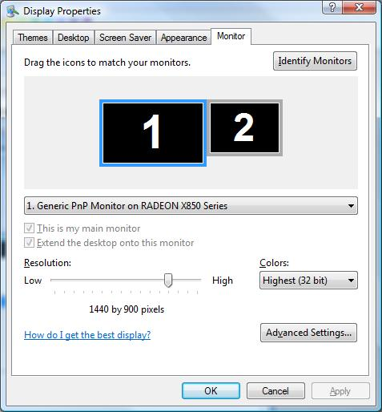
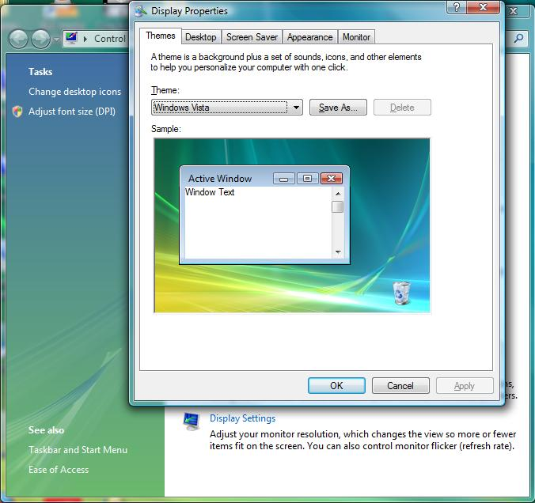
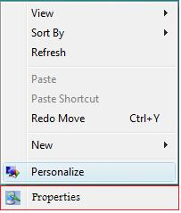

One of the things that annoys me in vista is the new personalization center. I feel it makes it harder to change multiple display options at once. This was just an experiment and I am not sure if it will have an other effects on the operating system. I want to keep in mind they say vista is "modular". They also state they have protection against system file modification (but this is a microsoft signed file...so i don't know if that will make a difference

**1.)experiment background**

c:\\windows\\system32\\desk.cpl is the control panel applet for personalization(at least the desktop settings part of it). The file has been upgraded since xp. the xp "desk.cpl" can be run in windows vista, this gives a tabbed version of the display properties window.

The first thing I tried was putting a renamed xp "desk.cpl" (called xpdesk.cpl) into my vista system32 directory. This did not work because the renamed file wouldn't work. the filename can't be changed.

Vista "desk.cpl"  
Filesize: 360KB  
Filedate: 11/02/2006

XP "desk.cpl"  
Filesize: 132KB  
Filedate: 08/03/2004

**2.)replacement of vista "desk.cpl" with xp "desk.cpl"**

Vista desk.cpl can be replaced with xp desk.cpl. I replaced from my other xp install. I had to take ownership of the vista "desk.cpl" to overwrite it. You maybe be able to change the file right from vista, but if you cant something like bartpe or knoppix would probrably work.

This does not get rid of the personalization window, but when you click something like "desktop settings" you get a tabled window. The desktop background and the new aero colds are still modified using the vista personalization center

 More pictures: https://www.techidiots.net/media/pictures/other/vista-with-xp-desk.cpl

**3.) Future Ideas/ Notes**

I don't think it is a good idea to replace this file. I would rather a solution that kept vistas desk.cpl and configuration screens in tack. One Idea is to keep the xp desk.cpl in a seperate folder, and somehow creating a "Properties" entry in the rightclick menu. This would leave the actual vista menus alone, and give quick access to the tabbed interface

