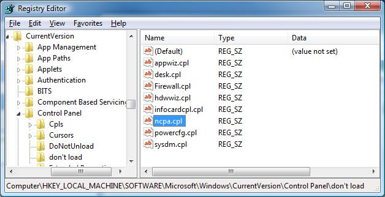
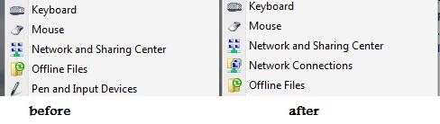

1.) Control Panel Icon
----------------------

In vista the ncpa.cpl file has been purposly removed from apearing in the control panel. You can renable it by deleting a registry key. "HKLM\\SOFTWARE\\Microsoft\\Windows\\CurrentVersion\\Control Panel\\don't load\\" is where microsoft puts cpls that it does not want to apear in control panel. You can delete "HKLM\\SOFTWARE\\Microsoft\\Windows\\CurrentVersion\\Control Panel\\don't load\\ncpa.cpl" and you will then have a "Network Connections" icon in your start menu.

