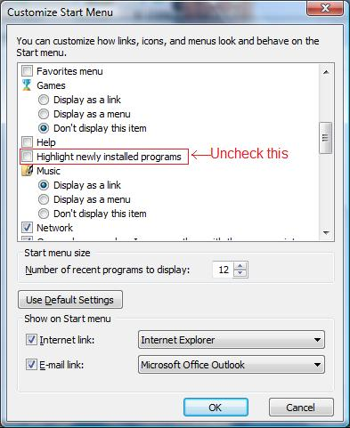
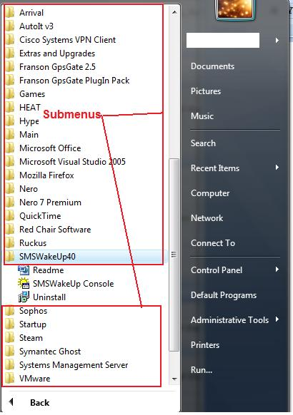

**Vista start menu slowness   
Andrew Calcutt  
2/9/07**

\*note – This does not apply if you are using the classic start menu

I have found that browsing “All Programs” in the default vista stat menu is slow. When a sub menu was clicked it took about 5 seconds to actually show the contents of that submenu. I was bothering me because I like the search function and didn't want to go to the classic start menu. I actually found this by accident when I was messing with options,

This somehow seems to be caused by the “Highlight newly installed programs” option in the “Customize start menu” section. If this option is unchecked the submenus load almost instantly.

Option location : "Taskbar and start menu properties" --&gt; "Start menu"\[tab\] --&gt; "Customize"

[gallery]

[/gallery]
